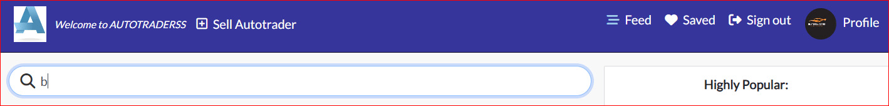
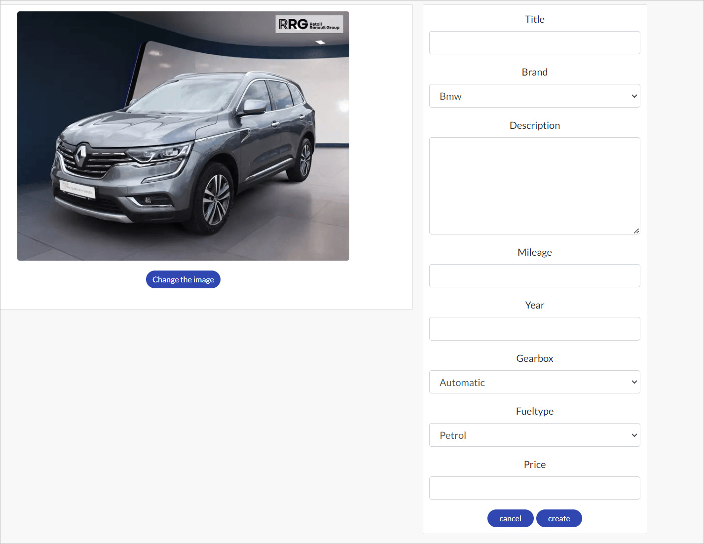
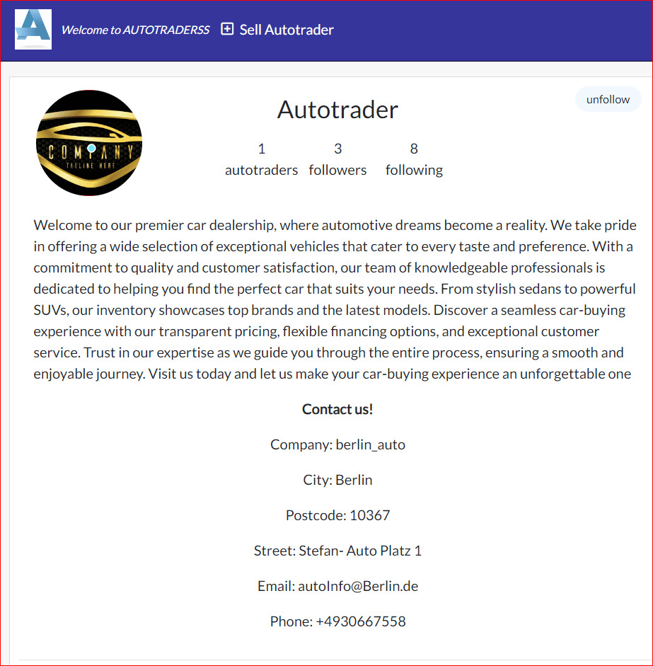
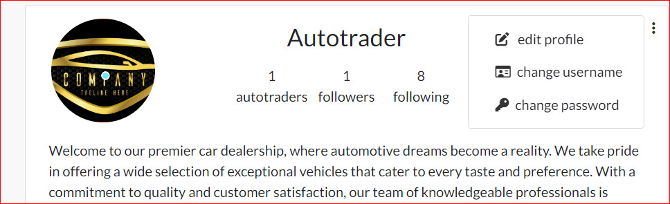
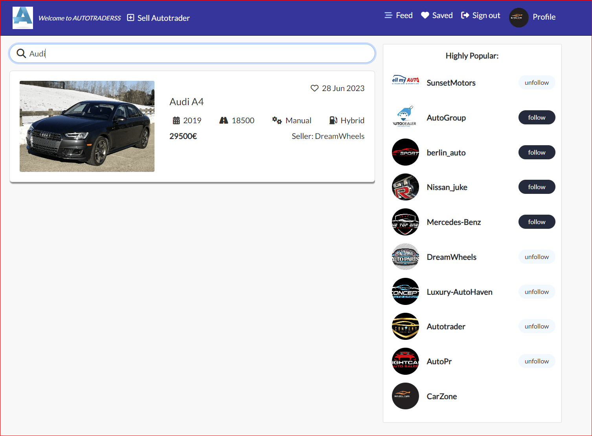
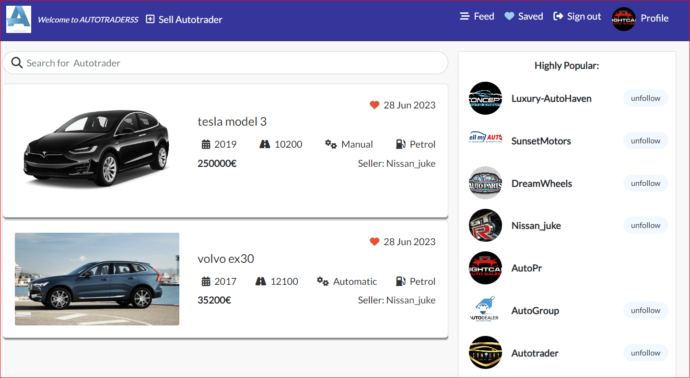

<h1 style="font-size: 36px; text-align: center;">Autotrader - A Vehicle Marketplace</h1>

<br>

<p align="center">
  
</p>

<br>


- Autotrader is an innovative vehicle marketplace platform exclusively tailored for the sale and purchase of used cars. Our 
  platform offers a seamless and user-friendly experience, empowering users to effortlessly create and browse listings. Here's why Autotrader is the ideal choice for all your car trading needs:

- Easy Listing Creation: Autotrader provides a simple and intuitive interface for users to create their own listings to sell their used cars. With just a few steps, sellers can showcase their
  vehicles with detailed descriptions, high-quality images, and relevant specifications to attract potential buyers.

- Extensive Car Search: As a visitor on Autotrader, you can easily search for used cars based on your specific requirements. Our 
  platform offers advanced search filters, allowing you to refine your search by make, model, year, mileage, and more. Find your dream car in no time!

- Enhanced User Features: By registering on Autotrader, users gain access to a range of additional features to enhance their car trading experience. You can save your favorite cars, enabling
  easy access and comparison of the vehicles you're most interested in. Additionally, you can follow specific car dealerships to stay updated on their latest inventory, ensuring you never miss out on a great deal.

- Seamless Frontend Experience: Autotrader's frontend is built using the React framework, ensuring a modern and responsive user interface. The frontend seamlessly connects and interacts with
  the backend API through efficient HTTP requests, providing a smooth and enjoyable user experience.

- Autotrader is committed to simplifying the process of buying and selling used cars, offering a reliable and secure platform for both buyers and sellers.
  Join Autotrader today and embark on a journey of hassle-free car trading.

<br>

  - [VIEW THE LIVE PROJECT HERE](https://autotraderss-react.herokuapp.com)

 - Links to the Backend API Project
   - [BACKEND - REPOSITORY](https://github.com/SuzanDewitz/autotraderss-drf-backend)
   - [BACKEND - DEPLOYMENT](https://autotraderss-drf-backend.herokuapp.com/)

<br>

 ## Table of Contents

+ [User Experience (UX)](#user-experience-ux)

  - [User Stories](#user-stories)
  - [Agile methodology](#agile-methodology)
  - [Design](#design)
  - [Wireframes](#wireframes)
+ [Future](#future)
     - [Future Features](#future-features)
- [Testing](#testing)
- [Validation](#validation)
     - [Bugs](#bugs)
     - [Fixed Bugs](#fixed-bugs)
     - [Remaining Bugs](#remaining-bugs)
- [Technologies Used](#technologies-used)
     - [Languages and Frameworks Used](#languages-and-frameworks-used)
     - [Frameworks Used](#frameworks-used)
     - [Python Modules Used](#python-modules-used)
     - [Packages Used](#packages-used)
     - [Programs and Tools Used](#programs-and-tools-used)
- [Deployment](#deployment)
    - [Forking the GitHub Repository](#forking-the-github-repository)
    - [Making a Local Clone](#making-a-local-clone)
    - [Deploying with Heroku](#deploying-with-heroku)
- [Credits](#credits)
     - [Code](#code)
     - [Media](#media)
     - [Acknowledgements](#acknowledgements)

## User Experience (UX)

- Welcome to Autotrader, the ultimate destination for car enthusiasts and buyers. Our goal is to provide a seamless and efficient 
  platform for individuals looking to buy or sell cars. With Autotrader, you can enjoy the following features:

+ Hassle-Free Car Listings: Autotrader offers a user-friendly interface that allows sellers to effortlessly create captivating car listings. 
  Our intuitive posting system ensures that sellers can showcase their vehicles with compelling descriptions and high-quality images.

+ Advanced Search Functionality: Finding your dream car is made easy with Autotrader's advanced search filters. You can refine your search based 
  on specific criteria such as make, model, year, mileage, and more. Our powerful search engine ensures that you find the perfect match for your preferences.

+ Personalized Car Collections: As a registered user, you have the convenience of saving cars to your personalized collection. This feature allows you to 
  keep track of your favorite options, compare them side by side, and make an informed decision when it's time to buy.

+ Seller Profiles: Autotrader provides comprehensive seller profiles, allowing sellers to showcase their inventory and provide detailed information about each car. 
  This way, buyers can get a complete picture of the vehicles and make well-informed decisions.

+ At Autotrader, I am committed to create a seamless car trading experience, connecting buyers and sellers in a user-friendly and secure online marketplace.
 Experience the future of car trading with Autotrader today!

<br>

## User Stories

- The user stories are readily available in the GitHub repository, neatly grouped into Epics for enhanced organization. This allows for easy tracking and management of project features. By organizing user stories into Epics, you can get
  a clear visual representation of the project's progress and understand the high-level goals and themes.

- To delve deeper into the details of each user story, including acceptance criteria and associated tasks, simply open the corresponding issue in the repository. Each user story is documented as an issue, providing a centralized location for
  all relevant information. This allows project stakeholders and team members to have a comprehensive understanding of the requirements and the specific tasks involved in implementing each user story.

- In addition to the issue-based documentation, a separate file has been created to house all user stories. This file serves as comprehensive documentation for the project, providing easy access to all user stories and their associated details.
  It ensures that anyone reviewing the project can quickly gain a thorough understanding of the project's requirements without having to navigate through individual issue

<br>

#### User stories for the frontend can be found in a separate internal document [here](https://github.com/SuzanDewitz/autotraderss-react-frontend/blob/main/docs/USERSTORIES.md)
####  Kanban board for the frontend can be found in a separate internal document [here](https://github.com/users/SuzanDewitz/projects/3/views/1)
####  admin for the frontend can be found in a separate internal document [here](https://github.com/SuzanDewitz/autotraderss-react-frontend/blob/main/docs/img/admin.md)

<br>

## Agile methodology

- During the project development, I embraced an Agile Methodology, leveraging the powerful capabilities of GitHub Projects to create User Stories. Each User Story was meticulously 
  crafted into an issue, encompassing clear acceptance criteria and associated tasks. To ensure streamlined organization, all User Stories were grouped into Milestones, representing the corresponding Epics, following the MOSCOW prioritization technique. For a comprehensive overview of the project's progress and workflow, I invite you to explore our dynamic Kanban board.

<br>

## Design

### Color Scheme
- I have made the decision to adopt a minimalistic design approach for the website. This choice aims to enhance the visibility of the site's content and detailed information, allowing them to 
  captivate users more effectively.

- The primary color utilized is rgb(49, 49, 156), which conveys a sense of tranquility and reliability. By employing this calm and trustworthy color, we aim to establish a foundation of trust with the user
   
 
<p align="center">
  
</p>

<br>

|                   | AutoTrader Vehicle Marketplace |
|-------------------|-------------------------------|
| Sign Up           | Sign In                       |
| Profile           | Feed                          |
| Search            | Saved                         |
| Listings          | Dealership                    |
| Details           | Follow                        |


<br>


<br>

### Typography

- In this project, I have implemented Google Fonts to enhance the visual appeal of the text. Specifically, we have utilized a font called "Lato" for its uniqu
 characteristics and aesthetic appeal. To achieve a visually pleasing and balanced presentation, we have opted for the medium font weight variant of Lato.

- Google Fonts provides a wide range of high-quality fonts that are easily accessible and compatible across different devices and browsers. By incorporating
  Lato with its medium weight, I aim to create a stylistic impression that complements the overall design of the project.

- API Integrations:The "API Integrations" component represents the connections between the backend and frontend systems through APIs. It includes the integration 
  points involved in your Autotrader marketplace, such as Autotrader data retrieval from external sources or communication between the frontend and backend servers.

<br>

### Wireframes
A separate document for wireframes can be found [HERE](https://github.com/SuzanDewitz/autotraderss-react-frontend/blob/main/docs/WIREFRAMES.md).


1. Backend-Frontend API:
   Describe the API connection between the backend and frontend systems in the project. This include data exchange, communication, integration points specific to the application architecture.

2. External Data Sources:
  the retrieves data from external sources, such as Autotrader details or pricing information, mention them here. Specify the types of data sources and their role in providing information to the application.

3. Third-Party APIs:
   the incorporates third-party APIs for additional functionalities, such as geolocation services, image processing, which I mention them in this section.

#### Key Features:
The "Key Features" section highlights the main features or functionalities that make the Autotrader marketplace unique and appealing to users.

1. Advanced Search:
   Describe any advanced search functionality that allows users to search for Autotrader based on various criteria such as make, model, year, price range, location, etc.

2. User Profiles:
   Explain how users can create profiles and manage their information, including personal details, saved searches, and favorite car.

3. Autotrader Listings:
  The Highlight the ability for users to create listings to sell their used cars, and for visitors to browse and view detailed information about available cars.

4. Saved Favorites:
   Emphasize the feature that enables users to save their favorite Autotrader and easily access them later for quick reference.

5. Follow Dealerships:
   This describes how users can choose to follow specific car dealerships on Autotrader to stay updated on their latest inventory and offerings.

#### User Roles:
  The "User Roles" section highlights five different user roles in your Autotrader marketplace:

1. Visitor:
   Represents users who are not logged in to the platform. They can browse and search for Autotrader but have limited access to certain features and functionalities.

2. Buyer:
   Represents users who are interested in purchasing an Autotrader from the marketplace. They can view Autotrader listings, save favorites, and contact sellers.

3. Seller:
   Represents users who want to sell their used car on the platform. They can create and manage their listings, communicate with potential buyers.

4. Registered User:
   Represents users who have registered and created an account on the Autotrader marketplace. They have additional benefits such as personalized profiles, saved searches, and enhanced communication features.

5. Admin:
   Represents the administrative role or staff members who have special privileges to manage and moderate the platform, including user management, listing verification, and handling disputes.

6. Contact Us:
   The "Contact Us" section includes contact details for users to get in touch with the Autotrader marketplace. an email address, phone number, and address.
  
 <br>


[Back to top](#top)

<br>

## Features

### Navbar & Search

- The navbar serves as a crucial element for easy navigation throughout the site. It allow users to explore different 
  sections and pages of the website conveniently. Whether it's accessing specific categories, browsing through listings, or accessing account-related information, the navbar provides a streamlined way to navigate the site.

- When a user opens the AutoTrader page, they cannot save other people's cars without logging in. They are required to log in first in order to save cars and also have
  the option to follow them. The navbar dynamically updates its links based on the user's state. For instance, if a user is logged in, they will see related to their account, 
  such as profile, follow, unfollow, and saved items. On the other hand, if a user is not logged in, they will not be able to save the cars they are interested in.

- Additionally, the navbar incorporates a search bar. This search functionality  enables users to search among the various listings available on the site. By simply entering 
  keywords or specific criteria into the search bar, users can quickly find relevant listings, making their browsing experience more efficient and tailored to their preferences.Overall, 
  the combination of a well-designed navbar and search functionality enhances the user experience by providing intuitive navigation and efficient access to desired content.

<br>



<br>

## Autotraders Listings:

- The autotraders listings section showcases a comprehensive collection of available autotraders. It serves as a centralized 
  platform for users to browse and explore various autotraders that are currently on the market. By aggregating a wide range of autotrader listings, it offers convenience and ease of access for potential buyers or interested individuals looking to explore different options.

- Vital Information:
  Each autotrader listing within the platform provides vital information to assist users in making informed decisions. This information typically includes essential details about the autotrader, such as:

1. Vehicle Specifications: The autotrader listing provides key details about the vehicle, such as the make, model, year of manufacture, mileage, engine type, and any additional features 
   or modifications.
2. Pricing: The listing displays the price of the autotrader, helping users evaluate whether it fits within their budget or price range.

<br>

   <p style="text-align: center;">
  
</p>

<br>

3. Condition: The condition of the autotrader, it shows as follow for example if the user want check 
  * car page, the following details are provided for the Mercedes-Benz B Electric Drive B:

### AutoTrader Details:

- **Brand:** Mercedes-Benz
- **Mileage:** 12,400
- **Year:** 2018
- **Gearbox:** Automatic
- **Fuel type:** Electric
- **Price:** €14,380

**Mercedes-Benz electric cars** offer a combination of luxury, performance, and sustainability. With their sleek designs, advanced electric powertrains, impressive performance, and practical ranges, they provide an attractive option for those seeking a greener and more enjoyable driving experience. Additionally, the integration of advanced technology, safety features, and a commitment to sustainability reflects Mercedes-Benz's dedication to innovation and a sustainable future.

4. Seller Contact Information: Contact details for the seller or dealership are provided, enabling interested users to reach out for further inquiries or to arrange a viewing or test drive.

By presenting these vital details within each autotrader listing, the platform aims to empower users with the necessary information to compare, evaluate, and make an informed choice when considering an autotrader purchase.


<br>


<br>

## Autotraders Detail Page:

- Autotraders Detail Page:The Autotraders Detail Page provides a comprehensive overview of the autotrader, offering users detailed information to help them make informed decisions. The page include specific fields such as brand, mileage, year, gearbox, fuel type, and price.

+ Comprehensive Autotrader Information: The Autotraders Detail Page ensures that users have access to crucial details about the car in autotrader page.

1. Brand: Displaying the brand, in this case "Renault," gives users a clear understanding of the manufacturer and helps them identify the specific make and model of the vehicle.

2. Mileage: Including the mileage of the autotrader, such as "11,200 miles," informs potential buyers about the distance the vehicle has traveled, allowing them to assess its usage and overall condition.

3. Year: Indicating the year of manufacture, such as "2020," provides users with an understanding of the autotrader's age and helps them gauge its technology, safety features, and potential wear and tear.

4. Gearbox: Mentioning the type of gearbox, like "Manual," informs users about the transmission system of the autotrader, which can be a crucial factor for certain buyers.

5. Fuel Type: Specifying the fuel type, such as "Hybrid," helps potential buyers understand the autotrader's energy source and its environmental impact.

6. Price: Displaying the price, like "€23,900," allows users to evaluate the affordability and value of the autotrader based on their budget and financial considerations.


+ Post Owner Control and Management:
1. In addition to providing detailed autotrader information, it's beneficial to equip post owners with control and management over their listings. This include:

2. Edit Post: Offering a link or button for post owners to edit the autotrader details enables them to make necessary updates to keep the listing accurate and up to date.

3. Delete Post: Providing a convenient option to delete the post allows post owners to remove the autotrader listing when it's no longer available for sale, ensuring that potential buyers don't encounter outdated or unavailable listings.

The page includes these features on the Autotraders Detail Page, enhancing the user experience by offering comprehensive autotrader information and empowering post owners with control over their listings


##  Autotraders Edit page

- The Autotraders Edit page is a dedicated page that allows users to update an existing autotrader post. It provides a convenient and user-friendly interface for modifying the details and information associated with a particular autotrader listing.


* Updating Autotrader Post:
On the Autotraders Edit page, users have the capability to make changes and updates to an existing autotrader post. This includes modifying various aspects of the autotrader listing, such as:

1. Editable Fields: Users can update fields such as the autotrader's price, description, technical specifications, features, condition, contact information, and any other relevant details associated with the autotrader.

2. Uploading New Images: Users may also have the option to upload new images or replace existing ones to provide potential buyers with updated visuals of the autotrader.

3. Correcting Information: If there were any inaccuracies or mistakes in the original autotrader post, the Autotraders Edit page allows users to correct and update the information, ensuring that the listing provides accurate and reliable details.

4. Saving Changes: Once users have made the desired updates to the autotrader post, they typically have the option to save the changes. This action ensures that the modified autotrader listing reflects the latest information and is visible to potential buyers.

<br>



<br>

## Profile page

- The profile page plays a vital role in providing sellers with a valuable opportunity to showcase their company effectively. It serves as a dedicated platform where sellers can present their company in a comprehensive and compelling manner to users.

- On the profile page, sellers have the ability to highlight their company's unique features, strengths, and offerings. This includes showcasing their products or services, sharing information about their brand story, mission, and values, and providing relevant contact details for potential customers to get in touch.

- The profile page allows sellers to create a visually appealing and informative presentation of their company. They can include high-quality images, and to engage users and convey their brand identity effectively.

- By leveraging the profile page, sellers can make a lasting impression on potential customers, increasing the likelihood of generating interest and driving conversions. It serves as a powerful tool for building trust, credibility, and establishing a strong online presence within the marketplace.

- Overall, the profile page serves as a critical component of the platform, enabling sellers to effectively market and promote their company, ultimately leading to increased visibility and business opportunities.

<br>

 

 <br>

## Edit Profile

- Edit Profile feature has been meticulously designed to facilitate sellers in effortlessly updating their existing information. It offers a user-friendly interface that empowers sellers 
  to make modifications to their profiles with ease, guaranteeing the accuracy and up-to-dateness of their information.

- This indispensable functionality enables sellers to preserve their relevancy in the market by consistently presenting the most current and pertinent details about their business to 
  potential customers. By utilizing the "Edit Profile" feature, sellers can ensure that their profiles are always up to date, thereby maximizing their chances of attracting and 
  engaging with prospective clients.

<br>

   

<br>

## Feed Page

- The Feed page showcases a meticulously curated collection of cars for sale, meticulously tailored to the specific preferences of each user. This thoughtfully designed feature presents 
  a comprehensive display of vehicles listed by the sellers whom the user follows, thereby offering a personalized and engaging experience.

- By aggregating and intelligently organizing these listings, the Feed page serves as a convenient and centralized platform for users to stay constantly updated with the latest inventory 
  from their preferred sellers. This ensures that users never miss out on exciting car opportunities and effortlessly provides them with a seamless browsing experience through 
  a personalized selection of vehicles that perfectly align with their unique interests and preferences

<br>



<br>


## Saved Page

- The Saved page serves as a meticulously designed and dedicated space, providing users with a seamless and convenient access point to view all the cars they have saved. This feature 
  acts as a personalized collection, offering users a platform to effortlessly keep track of vehicles that have captured their interest or that they intend to revisit at a later time.

- By offering a centralized location for saved cars, this page ensures that users can effortlessly retrieve and review their preferred selections. This simplifies the process of comparing 
  and considering options, making it easier for users to make informed purchasing decisions. With the Saved page, users can conveniently access their saved cars, enabling them to revisit and evaluate their choices in a streamlined manner.

<br>



<br>

## Future Features

- Enhanced Search Options and Filters: Expand the search capabilities by incorporating additional search options and filters  
  based on various criteria. This will empower users to refine their search results and find cars that precisely meet their specific requirements.

- Rating System for Buyers and Sellers: Introduce a rating system that enables buyers to rate their experiences with sellers.
  This feature promotes trust and credibility within the service, providing valuable feedback to other users and helping them make informed decisions when engaging with sellers.

- Location Algorithm for Local Searches: Implement a location-based algorithm that allows users to search for cars and sellers 
  within a certain distance from their specified location. This functionality enhances convenience by enabling users to find nearby options and facilitates localized transactions.

- Image Gallery Functionality: Integrate an image gallery feature that allows sellers to upload multiple pictures of their cars.This expanded visual representation provides potential 
  buyers with a more comprehensive view of the vehicles, aiding in their decision-making process.

- Different Registration Roles: Enhance the registration process by introducing different roles based on whether users are representing a company or are private individuals. 
  This distinction allows for tailored experiences, features, and functionalities based on the specific needs and preferences of different user types.

<br>

## Technologies Used

 - Languages
    - JavaScript
    - HTML5
    - CSS3
      
  <br>
  
 ## Frameworks, Libraries & Programs Used   
- [React](https://react.dev/) - Front-end JavaScript library for building user interfaces based on UI components.

- [React Bootstrap](https://react-bootstrap.github.io/) - Component-based library that provides native Bootstrap components as pure React components. Used to create a responsive application/component UI.

- [Axios](https://axios-http.com/) - Promise-based HTTP client for the browser and Node.js. Used to make HTTP requests from throughout the application.

- [jwt-decode](https://github.com/auth0/jwt-decode) - Used to decode and extract information from a JWT token.

- [react-router-dom](https://www.npmjs.com/package/react-router-dom) - Routing library for the React JavaScript library. Used to display 
 different components based on the URL entered in the browser.

- [drawSQL](https://drawsql.app/) - Tool used to create Database Schema/ERD.

- Git: Version control system used for tracking changes in the source code, with commits and pushes made using the terminal.
- [GitHub](https://github.com/): Platform used to store the project's code after being pushed from Git.
 
+ The following modules were installed or enabled in Gitpod to assist with formatting and code linting:

- [ESLint](https://eslint.org/) - A code linter that identifies and reports patterns or coding errors in the codebase.
- [Prettier](https://prettier.io/): An opinionated code formatter that helps maintain consistent code style across the project.

  <br>
  
  ## Testing
   - A separate document for testing can be found [here](https://github.com/SuzanDewitz/autotraderss-react-frontend/blob/main/docs/testing.md).

### Bugs
#### Fixed Bugs
  - [Click here](https://github.com/search?q=repo%3ASuzanDewitz%2Fautotraderss-react-frontend+fix&type=commits) to view a list of fixed bugs that has been completed.
#### Remaining Bugs
  - No known remaining bugs.

  - 
## Deployment

To deploy the project, follow these steps:

1. **Forking the GitHub Repository**

   - Go to the project repository.
   - In the top-right corner of the page, click the "Fork" button.
   - This will create a copy of the repository in your own GitHub account.

2. **Running the project locally**

   - Go to the project repository.
   - Click on the "Code" button.
   - Choose one of the three options (HTTPS, SSH, or GitHub CLI), and click copy.
   - Open your IDE program and launch the terminal.
   - Type `git clone` and paste the copied URL from step 3.
   - Press Enter, and the local clone of the project will be created.

   Alternatively, you can use Gitpod:

   - Go to the project repository.
   - Click the green button that says "Gitpod" to open the project in Gitpod.

3. **Deploying with Heroku**

   To deploy your project using Heroku, follow the steps below based on the Code Institute tutorial:

   - In the Gitpod CLI, run the following command to create the necessary files for Heroku to install project dependencies:
     ```
     pip3 freeze --local > requirements.txt
     ```
     *Note: Make sure to add the `requirements.txt` file to your `.gitignore` file to prevent it from being committed.*

   - Visit Heroku.com and log in. If you don't have an account, you will need to create one.
   - Click the "New" dropdown and select "Create New App".
   - Enter a unique name for your project. Heroku apps require a unique name, and you may be prompted to change it if it's already taken.

4. **Heroku Deployment**

   In the Heroku dashboard, follow these steps:

   - Go to the "Deploy" tab.
   - Connect your Heroku account to your GitHub Repository by following these steps:
     - Click on the "Connect to GitHub" button.
     - Enter the name of your GitHub repository and click on "Search".
     - Choose the correct repository for your application and click on "Connect".
   - Choose your preferred deployment method: manual or automatic.
     - Automatic deployment generates a new application every time you push a change to GitHub.
     - Manual deployment requires you to push the "Deploy Branch" button whenever you want a change to be made.
   - Once you have chosen your deployment method and clicked "Deploy Branch", Heroku will build your application.
   - Finally, you should see the "View" button. Click on it to open your deployed application.
  
## Credits

- **Online Documentation**
  - React documentation
  - React Bootstrap documentation and examples

- **Code**
  - The Moments tutorial by Code Institute was used to create the foundations on which I built upon to create the project.

- **Media**
  + The images used throughout the project are from
    - [autohaus24](www.autohaus24.de)
    - [sixtcarsales](https://www.sixtcarsales.de/)
    - [ebay](www.ebay.de)

## Acknowledgements
 
I would like to express my sincere gratitude to the following individuals and communities who have been instrumental in the success of this project:

- **My Husband**: I would like to extend my deepest appreciation to my husband, <a href="#" style="color: blue; text-decoration: none;">Dietmar Dewitz</a>, for his unwavering support, encouragement, and guidance throughout the development of all my projects. His advanced knowledge and expertise were instrumental in helping me overcome numerous technical challenges. Without his invaluable feedback and patience, these projects would not have been possible.
 
 - **my husband's colleagues**: I would also like to express my sincere gratitude to <a href="#" style="color: blue; text-decoration: none;">Praveen Kasam</a>, one of my husband's colleagues, for his time and effort in reviewing my projects. His feedback and suggestions were critical in shaping the final products. His expertise and critical evaluation helped me identify and fix issues that I would have otherwise missed.

- **Student Care Team**: I extend my heartfelt appreciation to the dedicated members of the Student Care Team who have provided guidance, assistance, and support during my studies. Their expertise and responsiveness have been crucial in overcoming challenges and ensuring a smooth learning experience.

- **Slack Community**: I would like to thank the vibrant and supportive Slack Community for their valuable contributions. The willingness of its members to share knowledge, provide feedback, and engage in meaningful discussions has played a significant role in my personal and professional growth.

- **Classmates**: A special mention goes to my classmates, who have been an incredible source of inspiration and collaboration. The shared experiences, discussions, and feedback have greatly enriched my learning and development.

- **Tutor**: I extend my heartfelt appreciation to my tutor for their expertise, guidance, and valuable feedback. Their dedication and commitment to helping me succeed have been instrumental in shaping this project.

I am deeply grateful to all those mentioned above and anyone else who has contributed in their own way to the development of this project. Your support and encouragement have made a significant difference. Thank you!

[Back to top](#top)
