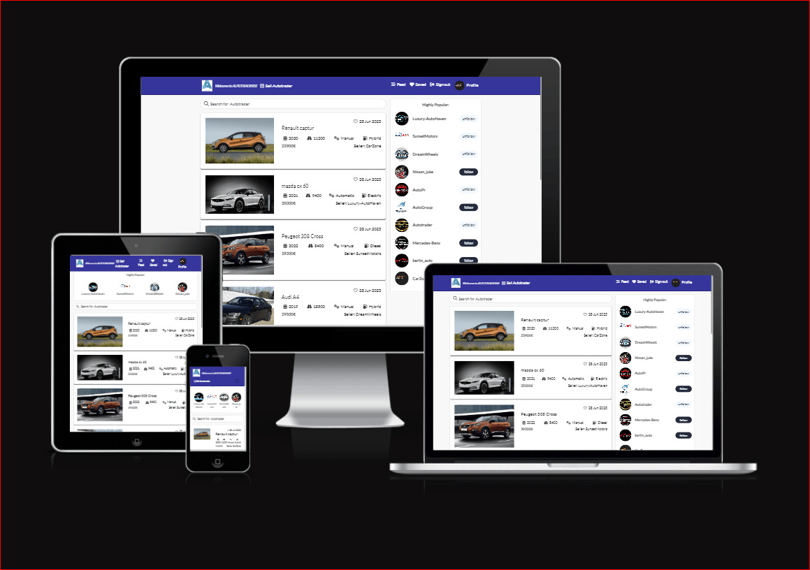

<p align="center">
  <h1 style="font-size: 36px;">Autotrader A vehicle marketplace</h1>
</p>

<br>


 


<p align="center">
  
</p>


<br>


- Autotrader is an innovative vehicle marketplace platform exclusively tailored for the sale and purchase of used cars. Our platform offers a seamless and user-friendly experience, empowering users to effortlessly create and browse listings. Here's why Autotrader is the ideal choice for all your car trading needs:

- Easy Listing Creation: Autotrader provides a simple and intuitive interface for users to create their own listings to sell their used cars. With just a few steps, sellers can showcase their vehicles with detailed descriptions, high-quality images, and relevant specifications to attract potential buyers.

- Extensive Car Search: As a visitor on Autotrader, you can easily search for used cars based on your specific requirements. Our platform offers advanced search filters, allowing you to refine your search by make, model, year, mileage, and more. Find your dream car in no time!

- Enhanced User Features: By registering on Autotrader, users gain access to a range of additional features to enhance their car trading experience. You can save your favorite cars, enabling easy access and comparison of the vehicles you're most interested in. Additionally, you can follow specific car dealerships to stay updated on their latest inventory, ensuring you never miss out on a great deal.

- Seamless Frontend Experience: Autotrader's frontend is built using the React framework, ensuring a modern and responsive user interface. The frontend seamlessly connects and interacts with the backend API through efficient HTTP requests, providing a smooth and enjoyable user experience.

- Autotrader is committed to simplifying the process of buying and selling used cars, offering a reliable and secure platform for both buyers and sellers. Join Autotrader today and embark on a journey of hassle-free car trading.

<br>

  - (View the live project here)[https://autotraderss-react.herokuapp.com]

 - Links to the Backend API Project
   - [Backend - Repository](https://github.com/SuzanDewitz/autotraderss-drf-backend)
   - [Backend - Deployment](https://autotraderss-drf-backend.herokuapp.com/)

<br>

 ## Table of Contents

+ [User Experience (UX)](#user-experience-ux)

  - [User Stories](#user-stories)
  - [Agile methodology](#agile-methodology)
  - [Design](#design)
  - [Wireframes](#wireframes)
+ [Future](#future)
     - [Future Features](#future-features)
- [Testing](#testing)
- [Validation](#validation)
     - [Bugs](#bugs)
     - [Fixed Bugs](#fixed-bugs)
     - [Remaining Bugs](#remaining-bugs)
- [Technologies Used](#technologies-used)
     - [Languages and Frameworks Used](#languages-and-frameworks-used)
     - [Frameworks Used](#frameworks-used)
     - [Python Modules Used](#python-modules-used)
     - [Packages Used](#packages-used)
     - [Programs and Tools Used](#programs-and-tools-used)
- [Deployment](#deployment)
    - [Forking the GitHub Repository](#forking-the-github-repository)
    - [Making a Local Clone](#making-a-local-clone)
    - [Deploying with Heroku](#deploying-with-heroku)
- [Credits](#credits)
     - [Code](#code)
     - [Media](#media)
     - [Acknowledgements](#acknowledgements)

## User Experience (UX)

- Welcome to Autotrader, the ultimate destination for car enthusiasts and buyers. Our goal is to provide a seamless and efficient platform for individuals looking to buy or sell cars. With Autotrader, you can enjoy the following features:

+ Hassle-Free Car Listings: Autotrader offers a user-friendly interface that allows sellers to effortlessly create captivating car listings. Our intuitive posting system ensures that sellers can showcase their vehicles with compelling descriptions and high-quality images.

+ Advanced Search Functionality: Finding your dream car is made easy with Autotrader's advanced search filters. You can refine your search based on specific criteria such as make, model, year, mileage, and more. Our powerful search engine ensures that you find the perfect match for your preferences.

+ Personalized Car Collections: As a registered user, you have the convenience of saving cars to your personalized collection. This feature allows you to keep track of your favorite options, compare them side by side, and make an informed decision when it's time to buy.

+ Seller Profiles: Autotrader provides comprehensive seller profiles, allowing sellers to showcase their inventory and provide detailed information about each car. This way, buyers can get a complete picture of the vehicles and make well-informed decisions.

+ At Autotrader, we are committed to creating a seamless car trading experience, connecting buyers and sellers in a user-friendly and secure online marketplace. Experience the future of car trading with Autotrader today!


<br>

## User Stories

- The user stories are readily available in the GitHub repository, neatly grouped into Epics for enhanced organization. Each user story can be viewed on the project's Kanban board, providing a clear visual representation of the project's progress. To delve deeper into the details of each user story, including acceptance criteria and associated tasks, simply open the corresponding issue in the repository. For comprehensive documentation, a separate file has been created to house all user stories, ensuring convenient access and a thorough understanding of the project requirements.

<br>

## Agile methodology

- During the project development, I embraced an Agile Methodology, leveraging the powerful capabilities of GitHub Projects to create User Stories. Each User Story was meticulously crafted into an issue, encompassing clear acceptance criteria and associated tasks. To ensure streamlined organization, all User Stories were grouped into Milestones, representing the corresponding Epics, following the MOSCOW prioritization technique. For a comprehensive overview of the project's progress and workflow, I invite you to explore our dynamic Kanban board, which can be accessed here.


<br>

## Design

### Color Scheme
- I have made the decision to adopt a minimalistic design approach for the website. This choice aims to enhance the visibility of the site's content and detailed information, allowing them to captivate users more effectively.

- The primary color utilized is rgb(49, 49, 156), which conveys a sense of tranquility and reliability. By employing this calm and trustworthy color, we aim to establish a foundation of trust with the user

  
 
   <p align="center">
  
</p>
 


<br>

|                   | AutoTrader Vehicle Marketplace |
|-------------------|-------------------------------|
| Sign Up           | Sign In                       |
| Profile           | Feed                          |
| Search            | Saved                         |
| Listings          | Dealership                    |
| Details           | Follow                        |


<br>


<br>

### Typography

- In this project, we have implemented Google Fonts to enhance the visual appeal of the text. Specifically, we have utilized a font called "Lato" for its unique characteristics and aesthetic appeal. To achieve a visually pleasing and balanced presentation, we have opted for the medium font weight variant of Lato.

- Google Fonts provides a wide range of high-quality fonts that are easily accessible and compatible across different devices and browsers. By incorporating Lato with its medium weight, we aim to create a stylistic impression that complements the overall design of the project.

- API Integrations:
The "API Integrations" component represents the connections between the backend and frontend systems through APIs. It includes the integration points involved in your Autotrader marketplace, such as Autotrader data retrieval from external sources or communication between the frontend and backend servers.

- Integration Points:
The "Integration Points" section highlights three types of integrations in your Autotrader marketplace:

### Wireframes
A separate document for wireframes can be found here.

1. Backend-Frontend API:
   Describe the API connection between the backend and frontend systems in your project. This may include data exchange, communication, or any other integration points specific to your application architecture.

2. External Data Sources:
  the retrieves data from external sources, such as Autotrader details or pricing information, mention them here. Specify the types of data sources and their role in providing information to your application.

3. Third-Party APIs:
   the incorporates third-party APIs for additional functionalities, such as geolocation services, image processing, mention them in this section.

Key Features:
The "Key Features" section highlights the main features or functionalities that make the Autotrader marketplace unique and appealing to users.

1. Advanced Search:
   Describe any advanced search functionality that allows users to search for Autotrader based on various criteria such as make, model, year, price range, location, etc.

2. User Profiles:
   Explain how users can create profiles and manage their information, including personal details, saved searches, and favorite Autotrader.

3. Autotrader Listings:
   Highlight the ability for users to create listings to sell their used cars, and for visitors to browse and view detailed information about available cars.

4. Saved Favorites:
   Emphasize the feature that enables users to save their favorite Autotrader and easily access them later for quick reference.

5. Follow Dealerships:
   Describe how users can choose to follow specific car dealerships on Autotrader to stay updated on their latest inventory and offerings.

User Roles:
The "User Roles" section highlights five different user roles in your Autotrader marketplace:

1. Visitor:
   Represents users who are not logged in to the platform. They can browse and search for Autotrader but have limited access to certain features and functionalities.

2. Buyer:
   Represents users who are interested in purchasing an Autotrader from the marketplace. They can view Autotrader listings, save favorites, and contact sellers.

3. Seller:
   Represents users who want to sell their used Autotrader on the platform. They can create and manage their listings, communicate with potential buyers, and complete sales transactions.

4. Registered User:
   Represents users who have registered and created an account on the Autotrader marketplace. They have additional benefits such as personalized profiles, saved searches, and enhanced communication features.

5. Admin:
   Represents the administrative role or staff members who have special privileges to manage and moderate the platform, including user management, listing verification, and handling disputes.

Contact Us:
The "Contact Us" section includes contact details for users to get in touch with the Autotrader marketplace. an email address, phone number, and address.
 
<br>

[Back to top](#top)

<br>

## Features

### Navbar & Search


- The navbar serves as a crucial element for easy navigation throughout the site. It includes essential links that allow users to explore different sections and pages of the website conveniently. Whether it's accessing specific categories, browsing through listings, or accessing account-related information, the navbar provides a streamlined way to navigate the site.

- The navbar also dynamically updates its links based on the user's state. For example, if a user is logged in, they may see links related to their account, such as profile, settings, or saved items. On the other hand, if a user is not logged in, the navbar may display links for login or registration.

- Additionally, the navbar often incorporates a search bar. This search functionality enables users to search among the various listings available on the site. By simply entering keywords or specific criteria into the search bar, users can quickly find relevant listings, making their browsing experience more efficient and tailored to their preferences.

Overall, the combination of a well-designed navbar and search functionality enhances the user experience by providing intuitive navigation and efficient access to desired content.

<p align="center">
  
</p>


<br>

## Autotraders List page

- Shows all the autotraders listings.
- Provides the vital information about each autotrader.

<br>

## Autotraders Detail Page:

- Presents a wealth of detailed information regarding the autotrader, enabling users to gain a comprehensive understanding of its specifications, features, and condition.
- Equips the post owner with convenient and easily accessible links to effortlessly update or delete the post, empowering them with seamless control and management over their listings.


<br>

##  Autotraders Edit page

- Provides capability to update an existing autotrader post.

## Profile page
- The profile page offers sellers a valuable opportunity to effectively showcase and present their company to users. It serves as a platform where sellers can highlight their company's unique features, strengths, and offerings, allowing them to make a compelling impression on potential customers.

<br>

## Edit Profile

-The "Edit Profile" feature enables sellers to effortlessly update their existing information. It provides a user-friendly interface where sellers can make modifications to their profiles, ensuring that their information remains accurate and up to date. 
- This functionality allows sellers to maintain relevancy and present the most current and relevant details about their business to potential customers.


<br>

## Feed Page

- The Feed page presents a curated collection of cars for sale, specifically tailored to the user's preferences. It showcases vehicles listed by the sellers whom the user is following. By aggregating and displaying these listings, the Feed page offers a convenient and centralized platform for users to stay up to date with the latest inventory from their preferred sellers.
- This ensures that users never miss out on exciting car opportunities and allows them to effortlessly browse through a personalized selection of vehicles that match their interests.

<br>

## Saved Page

-The Saved page serves as a dedicated space where users can conveniently access and view all the cars they have saved. It acts as a personalized collection, allowing users to keep track of vehicles that have caught their interest or that they intend to revisit later. 
-By providing a centralized location for saved cars, this page ensures that users can easily retrieve and review their preferred selections, simplifying the process of comparing and considering options when making purchasing decisions.

<br>

## Future Features

-Enhanced Search Options and Filters: Expand the search capabilities by incorporating additional search options and filters based on various criteria. This will empower users to refine their search results and find cars that precisely meet their specific requirements.

-Rating System for Buyers and Sellers: Introduce a rating system that enables buyers to rate their experiences with sellers. This feature promotes trust and credibility within the service, providing valuable feedback to other users and helping them make informed decisions when engaging with sellers.

-Location Algorithm for Local Searches: Implement a location-based algorithm that allows users to search for cars and sellers within a certain distance from their specified location. This functionality enhances convenience by enabling users to find nearby options and facilitates localized transactions.

-Image Gallery Functionality: Integrate an image gallery feature that allows sellers to upload multiple pictures of their cars. This expanded visual representation provides potential buyers with a more comprehensive view of the vehicles, aiding in their decision-making process.

-Different Registration Roles: Enhance the registration process by introducing different roles based on whether users are representing a company or are private individuals. This distinction allows for tailored experiences, features, and functionalities based on the specific needs and preferences of different user types.

<br>

## Technologies Used

 - Languages
    - JavaScript
    - HTML5
    - CSS3
      
  <br>
  
 ## Frameworks, Libraries & Programs Used   
- [React](https://react.dev/) - Front-end JavaScript library for building user interfaces based on UI components.

- [React Bootstrap](https://react-bootstrap.github.io/) - Component-based library that provides native Bootstrap components as pure React components. Used to create a responsive application/component UI.

- [Axios](https://axios-http.com/) - Promise-based HTTP client for the browser and Node.js. Used to make HTTP requests from throughout the application.

- [jwt-decode](https://github.com/auth0/jwt-decode) - Used to decode and extract information from a JWT token.

- [react-router-dom](https://www.npmjs.com/package/react-router-dom) - Routing library for the React JavaScript library. Used to display 
 different components based on the URL entered in the browser.

- [drawSQL](https://drawsql.app/) - Tool used to create Database Schema/ERD.

- Git: Version control system used for tracking changes in the source code, with commits and pushes made using the terminal.
- [GitHub](https://github.com/): Platform used to store the project's code after being pushed from Git.
 
+ The following modules were installed or enabled in Gitpod to assist with formatting and code linting:

- [ESLint](https://eslint.org/) - A code linter that identifies and reports patterns or coding errors in the codebase.
- [Prettier](https://prettier.io/): An opinionated code formatter that helps maintain consistent code style across the project.

  <br>
  
  ## Testing
   - A separate document for testing can be found here.

### Bugs
#### Fixed Bugs
  - Click here to view a list of fixed bugs that has been completed.
#### Remaining Bugs
  - No known remaining bugs.

  - 
## Deployment

To deploy the project, follow these steps:

1. **Forking the GitHub Repository**

   - Go to the project repository.
   - In the top-right corner of the page, click the "Fork" button.
   - This will create a copy of the repository in your own GitHub account.

2. **Running the project locally**

   - Go to the project repository.
   - Click on the "Code" button.
   - Choose one of the three options (HTTPS, SSH, or GitHub CLI), and click copy.
   - Open your IDE program and launch the terminal.
   - Type `git clone` and paste the copied URL from step 3.
   - Press Enter, and the local clone of the project will be created.

   Alternatively, you can use Gitpod:

   - Go to the project repository.
   - Click the green button that says "Gitpod" to open the project in Gitpod.

3. **Deploying with Heroku**

   To deploy your project using Heroku, follow the steps below based on the Code Institute tutorial:

   - In the Gitpod CLI, run the following command to create the necessary files for Heroku to install project dependencies:
     ```
     pip3 freeze --local > requirements.txt
     ```
     *Note: Make sure to add the `requirements.txt` file to your `.gitignore` file to prevent it from being committed.*

   - Visit Heroku.com and log in. If you don't have an account, you will need to create one.
   - Click the "New" dropdown and select "Create New App".
   - Enter a unique name for your project. Heroku apps require a unique name, and you may be prompted to change it if it's already taken.

4. **Heroku Deployment**

   In the Heroku dashboard, follow these steps:

   - Go to the "Deploy" tab.
   - Connect your Heroku account to your GitHub Repository by following these steps:
     - Click on the "Connect to GitHub" button.
     - Enter the name of your GitHub repository and click on "Search".
     - Choose the correct repository for your application and click on "Connect".
   - Choose your preferred deployment method: manual or automatic.
     - Automatic deployment generates a new application every time you push a change to GitHub.
     - Manual deployment requires you to push the "Deploy Branch" button whenever you want a change to be made.
   - Once you have chosen your deployment method and clicked "Deploy Branch", Heroku will build your application.
   - Finally, you should see the "View" button. Click on it to open your deployed application.
  
## Credits

- **Online Documentation**
  - React documentation
  - React Bootstrap documentation and examples

- **Code**
  - The Moments tutorial by Code Institute was used to create the foundations on which I built upon to create the project.

- **Media**
  - The images used throughout the project are from
  - [autohaus24](www.autohaus24.de)
  - [sixtcarsales](https://www.sixtcarsales.de/)
  - [ebay](www.ebay.de)

## Acknowledgements
 
I would like to express my sincere gratitude to the following individuals and communities who have been instrumental in the success of this project:

- **My Husband**: I would like to extend my deepest appreciation to my husband, <a href="#" style="color: blue; text-decoration: none;">Dietmar Dewitz</a>, for his unwavering support, encouragement, and guidance throughout the development of all my projects. His advanced knowledge and expertise were instrumental in helping me overcome numerous technical challenges. Without his invaluable feedback and patience, these projects would not have been possible.
 
 - **my husband's colleagues**: I would also like to express my sincere gratitude to <a href="#" style="color: blue; text-decoration: none;">Praveen Kasam</a>, one of my husband's colleagues, for his time and effort in reviewing my projects. His feedback and suggestions were critical in shaping the final products. His expertise and critical evaluation helped me identify and fix issues that I would have otherwise missed.

- **Student Care Team**: I extend my heartfelt appreciation to the dedicated members of the Student Care Team who have provided guidance, assistance, and support during my studies. Their expertise and responsiveness have been crucial in overcoming challenges and ensuring a smooth learning experience.

- **Slack Community**: I would like to thank the vibrant and supportive Slack Community for their valuable contributions. The willingness of its members to share knowledge, provide feedback, and engage in meaningful discussions has played a significant role in my personal and professional growth.

- **Classmates**: A special mention goes to my classmates, who have been an incredible source of inspiration and collaboration. The shared experiences, discussions, and feedback have greatly enriched my learning and development.

- **Tutor**: I extend my heartfelt appreciation to my tutor for their expertise, guidance, and valuable feedback. Their dedication and commitment to helping me succeed have been instrumental in shaping this project.

I am deeply grateful to all those mentioned above and anyone else who has contributed in their own way to the development of this project. Your support and encouragement have made a significant difference. Thank you!

[Back to top](#top)
