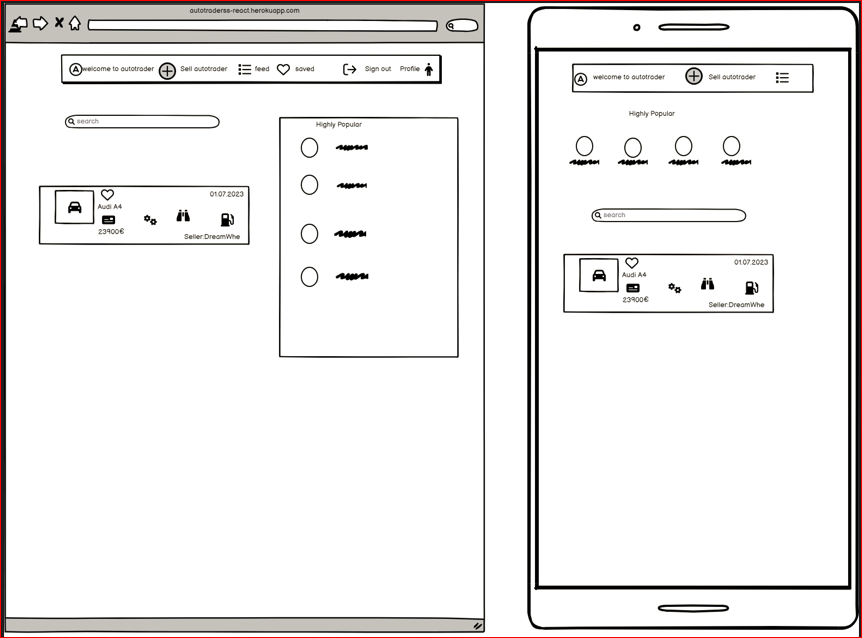
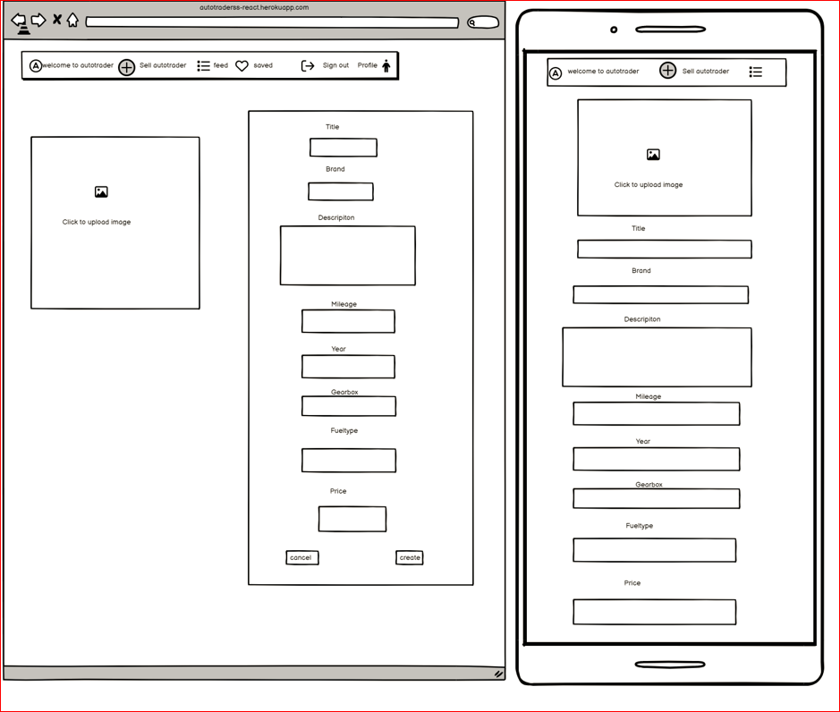
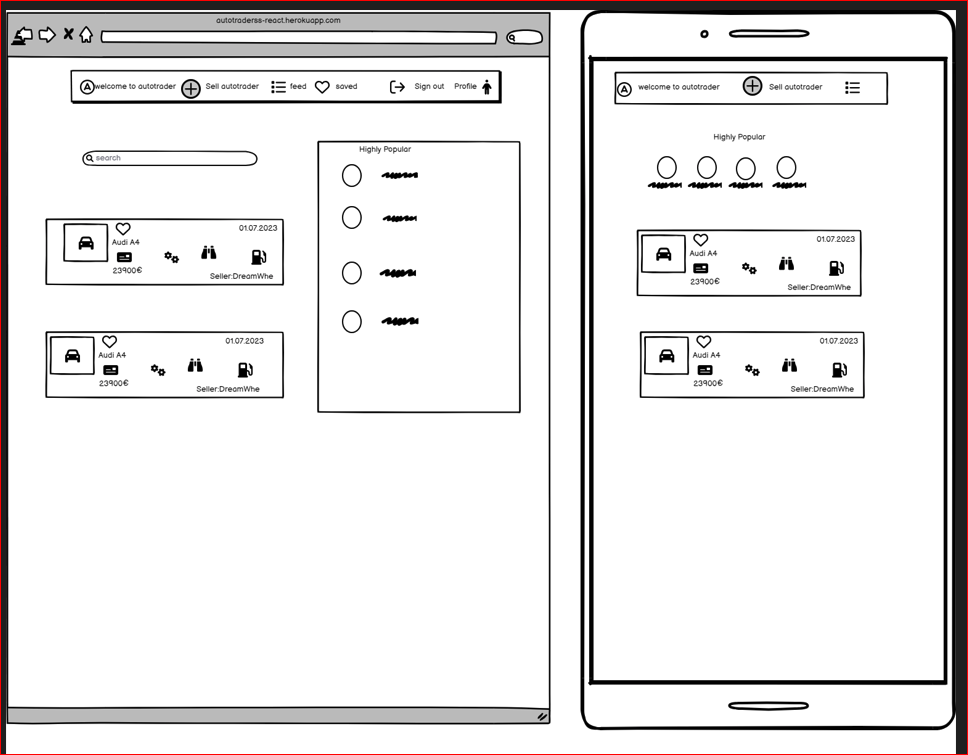

#### Landing Page 
The Landing Page wireframe represents the landing page of your application. It serves as the initial screen that users see when they visit your website or open the app. The wireframe showcases the main elements and sections of the page, such as a header, navigation, featured content, and any other relevant components

 

 

#### Feed Page
The Feed Page wireframe showcases a dynamic and personalized feed or stream of car listings on Autotrader. It presents a collection of car listings in a scrollable format, allowing users to browse through the available cars and interact with them, such as by liking, commenting, or saving.

 

#### Create Autotrader Page
The Create Autotrader Page wireframe illustrates the form or interface where users can create a new car listing on Autotrader. It typically includes fields and sections for users to input details about the car they want to sell or list, such as the car's make, model, year, condition, pricing, and any other relevant information.

 

##### Saved Page
The Saved Page wireframe represents a section or page where users can view and manage their saved or bookmarked cars on Autotrader. It provides a collection of cars that users have marked as favorites or have saved for later viewing. This page may include options to organize or filter the saved cars based on different criteria.

 

##### Profile Page
The Profile Page wireframe represents a user's profile or account page on Autotrader. It displays information about the user, such as their username, profile picture, and any additional details they have chosen to include. The profile page may also include sections for managing account settings, viewing activity history, and accessing personalized features.

 

Return to [README.md](https://github.com/SuzanDewitz/autotraderss-react-frontend/blob/main/README.md)
