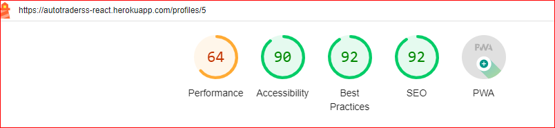

# Testing

## Table of Contents

- [Navigation](#navigation)
- [Authentication](#authentication)
- [Autotrader](#autotrader)
- [Account](#account)
- [Code Validation](#code-validation)
  - [JSX](#jsx)
  - [Validator_Testing](#Validator-Testing)
  - [Lighthouse Scores](#lighthouse-scores)

### Navigation

| Test  | Test                                                                                                                                            | Result |
| ------ | ----------------------------------------------------------------------------------------------------------------------------------------------- | ------ |
| 1      | _As a_ user,  I should be able to find and access the navigation bar on every page for easy navigation to different sections of the website. | PASS   |
| 2      | _As a_ user,  I should be able to scroll without pagination to find more car ads.                                                   | PASS   |
| 3      | _As a_ user,  I should be able to search for keywords in the search bar to quickly find cars with specific specifications.
### Account

| Test  | Test                                                                                                    | Result |
| ------ | ------------------------------------------------------------------------------------------------------- | ------ |
| 1      | _As a_ user, I should be able to find a column displaying the "Highly Popularto" conveniently check them first. | PASS   |
| 2      | _As a_ user, I should be able to click on a profile to access more information about the seller.       | PASS   |
| 3      | _As a_ user,  I should be able to edit my profile to update or change my information.             | PASS   |

### Autotrader

| Test  | Test                                                                                                              | Result |
| ------ | ----------------------------------------------------------------------------------------------------------------- | ------ |
| 1      | _As a_ user, I should be able to delete an Autotrader ad to remove it from being visible to other visitors.                   | PASS   |
| 2      | _As a_ user, I should be able to edit an Autotrader ad to update the information.                                  | PASS   |
| 3      | _As a_ user, I should be able to create an ad for my car, allowing others to view it and make inquiries to buy my car.   | PASS   |
| 4      | _As a_ user, I should be able to find all the Autotraders on the main page to search for ones that may be of interest to me. | PASS   |
| 5      | _As a_ user, I should be able to click on an Autotrader to view more details about the car.                              | PASS   |

### Authentication

| Test | Test                                                                                                               | Result |
| ------ | ------------------------------------------------------------------------------------------------------------------ | ------ |
| 1      | _As a_ user, I should be able to register an account, which grants me access to all site features and enables me to create an Autotrader sales ad.   | PASS   |
| 2      | _As a_ user, I should be able to log in to my account, allowing me to utilize the site's features and access my profile.          | PASS   |
| 3      | _As a_ user, I should be able to log out to maintain the security of my account.                                                 | PASS   |
| 4      | _As an_ admin, I should be able to configure the access tokens to refresh, preventing users from being automatically logged out too frequently. | PASS   |

## Code Validation

### JSX

- Throughout the development process, the JSX code underwent meticulous validation and underwent a continuous refinement process. This rigorous approach aimed to guarantee the impeccable quality of the code as the project progressed. By subjecting the JSX code to thorough validation, potential errors and issues were diligently identified and addressed. Additionally, through the continuous refinement process, the code was regularly reviewed, optimized, and improved to enhance its performance, readability, and adherence to coding standards. This commitment to ensuring the excellence of the JSX code resulted in a high-quality user interface and minimized the occurrence of bugs or inconsistencies, ultimately enhancing the overall user experience.

### Validator Testing
- CSS files pass through the Jigsaw validator with no issues found.
  - [W3C Markup Validator](https://jigsaw.w3.org/css-validator/)

 

   

   

 

### Lighthouse Report

- The main pages of the deployed site was run through Lighthouse on Google Chrome.

   + Main Page Desktop

    

 

  

 

 

 

  

 

 

 

  + Main Page Mobile

   
  

Return to [README.md](https://github.com/SuzanDewitz/autotraderss-react-frontend/blob/main/README.md)

 

[Back to top](#top)

